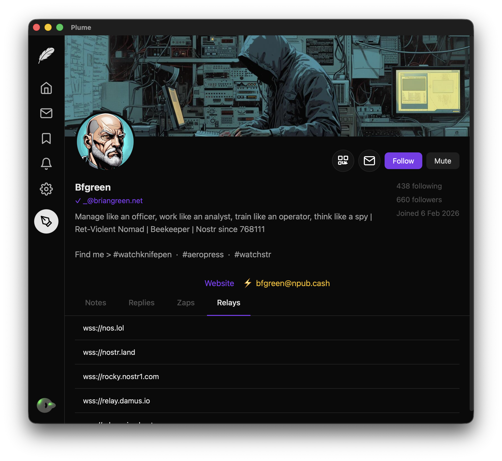

# Plume

<p>

A cross-platform Nostr desktop client built with Rust and Tauri.
<br style="clear: both;">
</p>

## Features

- Browse Nostr notes from multiple relays
- View images and videos embedded in notes
- Manage your Nostr identity (public/private keys)
- Configure relay connections
- Secure encrypted chat with Nostr users
- Cross-platform: MacOS, Linux, Windows
- Localisations for English, French, German, Spanish, Italian

## Screenshots

| Home feed | Profile |
|-----------|---------|
|  |  |

## Relay I/O architecture

Feed streaming uses an **async, selector-based** design for scalability and performance:

- **Selector-based I/O** – One Tokio runtime multiplexes many relay connections. When any socket has data, the runtime wakes and dispatches to that relay’s handler instead of blocking one thread per connection.
- **Per-relay push-parser pipeline** – Each relay has a dedicated channel handler. Incoming WebSocket messages are pushed into a streaming JSON parser; the handler pulls parser events and recognises complete Nostr events as they are parsed. Notes are submitted to the UI as soon as they are available, with no separate thread “monitoring” for complete messages.
- **Scalability** – Connecting to many relays no longer implies many OS threads. A small number of threads serve all connections via non-blocking I/O and async tasks.
- **Performance** – Events are streamed to the UI as they arrive; parsing is incremental and event-driven, so the app stays responsive under load.

## Nostr Protocol Support

Plume implements the following [NIPs](https://github.com/nostr-protocol/nips) (Nostr Implementation Possibilities):

| NIP | Description | Notes |
|-----|-------------|-------|
| [01](https://github.com/nostr-protocol/nips/blob/master/01.md) | Basic protocol | Events, filters (`ids`, `authors`, `kinds`, `since`, `until`, `#e`, `#p`), relay WebSocket communication (`REQ`/`EVENT`/`EOSE`/`CLOSE`) |
| [02](https://github.com/nostr-protocol/nips/blob/master/02.md) | Contact list (kind 3) | Follow/unfollow, follower discovery, optional relay hints and petnames |
| [04](https://github.com/nostr-protocol/nips/blob/master/04.md) | Encrypted direct messages (kind 4) | ECDH shared secret, AES-256-CBC encryption/decryption |
| [05](https://github.com/nostr-protocol/nips/blob/master/05.md) | DNS-based identifiers | Stored and displayed in profiles; no server-side `.well-known` resolution yet |
| [10](https://github.com/nostr-protocol/nips/blob/master/10.md) | Reply threading conventions | `e` tag markers (`reply`, `root`), reply-to display, threaded note detail view |
| [18](https://github.com/nostr-protocol/nips/blob/master/18.md) | Reposts (kind 6) | Creating and displaying reposts with embedded original note |
| [19](https://github.com/nostr-protocol/nips/blob/master/19.md) | Bech32 shareable identifiers | `npub`, `nsec`, `note` (simple encoding), `nevent` and `nprofile` (TLV encoding with relay hints) |
| [25](https://github.com/nostr-protocol/nips/blob/master/25.md) | Reactions (kind 7) | Like/react with emoji, reaction counts |
| [57](https://github.com/nostr-protocol/nips/blob/master/57.md) | Lightning zaps (kind 9734) | Zap requests via LUD-16 (`lud16`), LNURL callback flow, configurable default amount |
| [65](https://github.com/nostr-protocol/nips/blob/master/65.md) | Relay list metadata (kind 10002) | Fetching and displaying relay lists, read/write designations |

### Additional protocol features

- **Schnorr signature verification** (BIP-340 / secp256k1) for event signing and verification
- **Inline media embedding** for images (jpg, png, gif, webp) and video (mp4, webm, mov) URLs in note content
- **`nostr:` URI embedding** in notes: `npub`/`nprofile` rendered as clickable profile links, `note`/`nevent` rendered as embedded note cards with recursive resolution (depth limit of 5)
- **Multi-profile management** with per-identity directories and profile switching
- **Content sanitisation** with HTML escaping and URL sanitisation to mitigate XSS

## Prerequisites

### MacOS

```bash
# Install Xcode Command Line Tools
xcode-select --install

# Install Rust (recommended method)
curl --proto '=https' --tlsv1.2 -sSf https://sh.rustup.rs | sh

# Install Tauri CLI
cargo install tauri-cli
```

### Linux (Debian/Ubuntu)

```bash
# Install system dependencies
sudo apt update
sudo apt install libwebkit2gtk-4.1-dev build-essential curl wget file \
    libssl-dev libgtk-3-dev libayatana-appindicator3-dev librsvg2-dev

# Install Rust
curl --proto '=https' --tlsv1.2 -sSf https://sh.rustup.rs | sh

# Install Tauri CLI
cargo install tauri-cli
```

### Windows

1. Install [Microsoft Visual Studio C++ Build Tools](https://visualstudio.microsoft.com/visual-cpp-build-tools/)
2. Install [Rust](https://rustup.rs/)
3. Run: `cargo install tauri-cli`

## Building

```bash
# Development build (faster, with debug symbols)
make build

# Release build (optimized binary only)
make release

# Build macOS .app bundle (generates icons if needed, then packages)
make app
```

`make app` will:

1. Check for app icons — if `icons/icon.icns` is missing, automatically generates all required sizes from `icons/app-icon.svg` (requires ImageMagick, librsvg, or Python cairosvg)
2. Run `cargo tauri build` to compile an optimised release binary and package it

The output is:

| Artifact | Path |
|----------|------|
| macOS app bundle | `target/release/bundle/macos/Plume.app` |
| macOS disk image | `target/release/bundle/dmg/Plume_<version>_<arch>.dmg` |

To regenerate icons manually (e.g. after changing the source SVG):

```bash
make icons
```

## Running

```bash
# Development mode with hot reload
make run

# Or directly with cargo
cargo tauri dev

# Run the release binary directly (without .app bundle)
make run-release
```

### Debug logging

Connection-level and protocol-level logging is silent by default. To enable verbose output for troubleshooting relay connections, WebSocket frames, and backoff behaviour:

```bash
PLUME_DEBUG=1 cargo tauri dev
```

## Configuration

Plume stores all data under `~/.plume/`:

```
~/.plume/
├── plume.json                        # App-level config (active profile, known profiles)
└── profiles/
    └── <npub>/
        ├── config.json               # Profile config (keys, relays, settings, contacts)
        └── messages/
            └── <hex-pubkey>.json     # Cached DM conversation (raw kind 4 events)
```

Each profile's `config.json` holds:

- Nostr public key (required) and private key (optional, for posting)
- Relay URLs
- Profile metadata (name, about, picture, nip05, banner, website, lud16)
- Following list, muted users/words/hashtags, bookmarks
- App preferences (feed mode, default zap amount, etc.)

**Messages** (NIP-04 encrypted DMs) are cached locally and synced with relays on startup. Unread status persists across sessions.

## License

GPL-3.0 - See [COPYING](COPYING) for details.

## Contributing

Contributions are welcome! Please feel free to submit issues and pull requests.

Offers to translate into other languages are especially welcome!

## Nostr Resources

- [Nostr Protocol](https://github.com/nostr-protocol/nostr) - Protocol specification
- [NIPs](https://github.com/nostr-protocol/nips) - Nostr Implementation Possibilities
- [Awesome Nostr](https://github.com/aljazceru/awesome-nostr) - Curated list of Nostr resources
